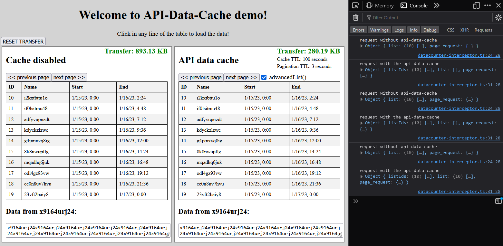

<div id="top"></div>


<!-- PROJECT LOGO -->
<br />
<div align="center">
  <!-- <a href="https://github.com/">
    
  </a> -->

  <h3 align="center">API DATA CACHE </h3>

  <p align="center">
    Reduce data transfer from servers by storing structured data locally.
    <br />
    <a href="https://cviolbarbosa.github.io/api-data-cache/"><strong>Explore the docs »</strong></a>
    <br />
    <br />
    <a href="https://github.com/">View Demo</a>
    ·
    <a href="https://github.com/cviolbarbosa/api-data-cache/issues">Report Bug</a>
    ·
    <a href="https://github.com/cviolbarbosa/api-data-cache/issues">Request Feature</a>
  </p>
</div>


## About The Project

This project originated from the necessity of reducing the data trafic and serialization time of large objects transmitted from backend to frontend. The api-data-cache decreases considerably lag times improving the application responsiveness and user experience. Drawing inspiration from Redux, the library adopts a central immutable store approach where each data object becomes accessible to all application views through the data cache.


### Key Features

* Simplified CRUD Operations: This library provides a single class that extends services and encompasses all CRUD methods, including CREATE, LIST, GET, UPDATE, and DELETE. This streamlines your data management and reduces boilerplate code.

* Efficient Caching Mechanism: The `get` operations benefit from a long period cache, while `list` operations (pagination) utilize a short period cache. This caching strategy optimizes data retrieval and minimizes redundant server requests.

* Advanced Filtering Support: The library offers an advanced list method that enables you to retrieve a filtered list of objects. This empowers you to tailor data requests to specific criteria, improving data retrieval efficiency.

* Custom Data Serialization: The library provides special options for data serialization during updating and creating operations. This customization feature enhances flexibility, ensuring that data is transmitted and processed in the most efficient format.


This library is initially designed to seamlessly integrate with the HttpClient from Angular 2+ but can be easily adapted to work with other platforms as well (see the httpProxy interface). It serves as a powerful tool to optimize data management and improve the overall performance of web applications.

## Installation

To install the `api-data-cache` package, use the following npm command:

```shell 
$ npm install api-data-cache --save
```

## Demo

To run the demo, follow these steps:

1. Navigate to the `./demo` folder.
2. Run the Node.js server by executing the following command in the terminal:

```bash
node server.js
```

3. Open a second terminal and start the Angular project with the following command:

```bash
npm start
```

By following these steps, you should have the demo up and running, showcasing the basic functionality of the `api-data-cache` package.



## Usage

The api-data-cache is useful when your app has a `list view` and a `detail view`. 
In the list view, only essential properties are loaded for many objects, while the detail view shows a single object with all its properties and nested relationships.

As an illustrative example, let's consider an app that lists books using the default REST API pattern with the following endpoints:

* `GET /book/`: Retrieve a list with many objects (list view).
* `POST /book/`: Create a new book and return its ID.
* `GET /book/:id/`: Retrieve the detailed data of a single book with a given ID (detail view).
* `PATCH /book/:id/`: Update the book with a given ID.
* `POST /book/filtered/`: An advanced list endpoint with filter operation support.


In this scenario, the backend should use a shallow or partial serializer for the `GET /book/` endpoint to minimize data traffic and improve loading times in the list view. On the other hand, for the `GET /book/:id/` endpoint, a fully-nested serializer should be employed to ensure all relevant details and nested relationships are available in the detail view.

By adopting this approach and properly configuring the api-data-cache, you can significantly enhance the performance and user experience of your application, reducing unnecessary server requests and optimizing data retrieval for various views.

#### book.service.ts
```js 
import { Injectable } from '@angular/core';
import { HttpClient } from '@angular/common/http';
import {BookModel} from './app.models'
import {ApiDataCacheService} from 'api-data-cache';

const my_edit_create_serializer = (data) => data;

@Injectable({
  providedIn: 'root'
})
export class BookService extends ApiDataCacheService <BookModel> {

  constructor(public http: HttpClient) {
    const url = 'http://localhost:9000/book';      
    const cacheTTL = 100;   //  Time to live of each data record (min 10 seconds)
    const options: DataCacheOptions = { 
      advancedListEndpoint :'http://localhost:9000/book/filtered',
      trailingSlash: true,
      mutationPreventionStrategy: 'simpleRecursiveClone',
      serverResponseTTL: 3    // 0  - 5 seconds 
    }
    super(http, url, cacheTTL, options);
    this.requestHeaders = {'headers': new HttpHeaders({'MyHeader':'foo'})};
    this.serializer = my_edit_create_serializer;  // optional

  }
```

#### book.component.ts
```js
import { Component } from '@angular/core';
import { BookService } from '@ngx-formly/core';

@Component({
  selector: 'app-root',
  template: `
          <div *ngIf="books" style="display: flex" >
                <div *ngFor="let book in books" (click)="selectBook(book.id)" style="border: solid">
                      {{books | json}}
                </div>
                <div style="border: solid">
                  {{selectedBook | json}} 
                </div>
          </div>
  `,
})
export class AppComponent {
  public books: Partial<BookModel>[];
  public selectedBook: BookModel;

  constructor(bookService: BookService) {
  // results are cached for 2 seconds, avoiding needless requests to the server.
    	this.bookService.list().subscribe(r => this.books = r);
  }

  selectBook(id: string | number){
  // results are cached for 300 seconds, avoiding needless requests to server when browsing through items.
      this.bookService.get(id).subscribe(r => this.selectedBook = r);
  }

  updateBook(book:Partial<BookModel>){
  // dispatch the patch request and update instance in cache.
      this.bookService.edit(book).subscribe();
  }

  createBook(book:Partial<BookModel>){
  // dispatch the patch request and update instance in cache.
      this.bookService.create(book).subscribe();
  }

  searchBooks(queryStr:string, filterObj:Partial<BookModel>){
  // POST request composed of querystring in the url and filtering object at the message body.
    const lstOptions = new AdvancedListOptions();
    lstOptions.filter = filterObj;
    lstOptions.searchScope = 'server'; // 'local' | 'server' | 'local+server'
    this.bookService.advancedList(queryStr, lstOptions).subscribe((r => this.books = r));
  }

}
```


### Contributing

### Authors 
*   Carlos E. Viol Barbosa


### License

This project is licensed under the MIT License
